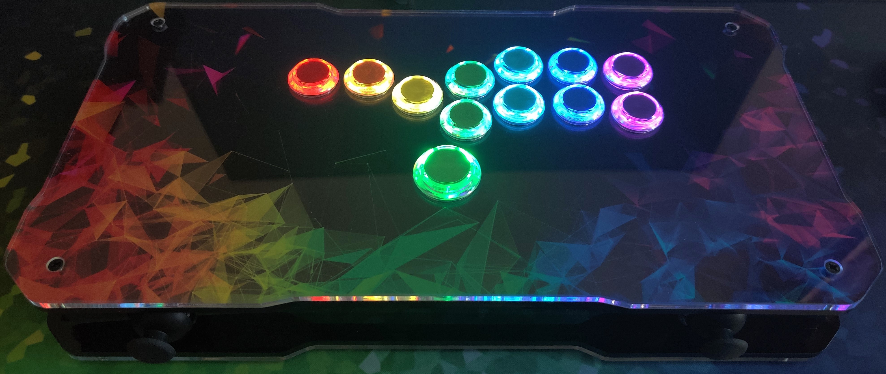
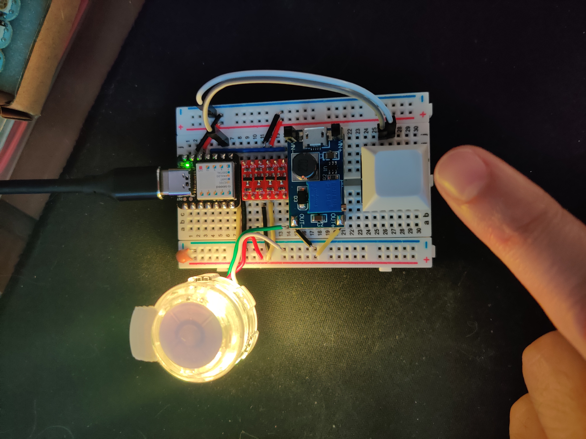
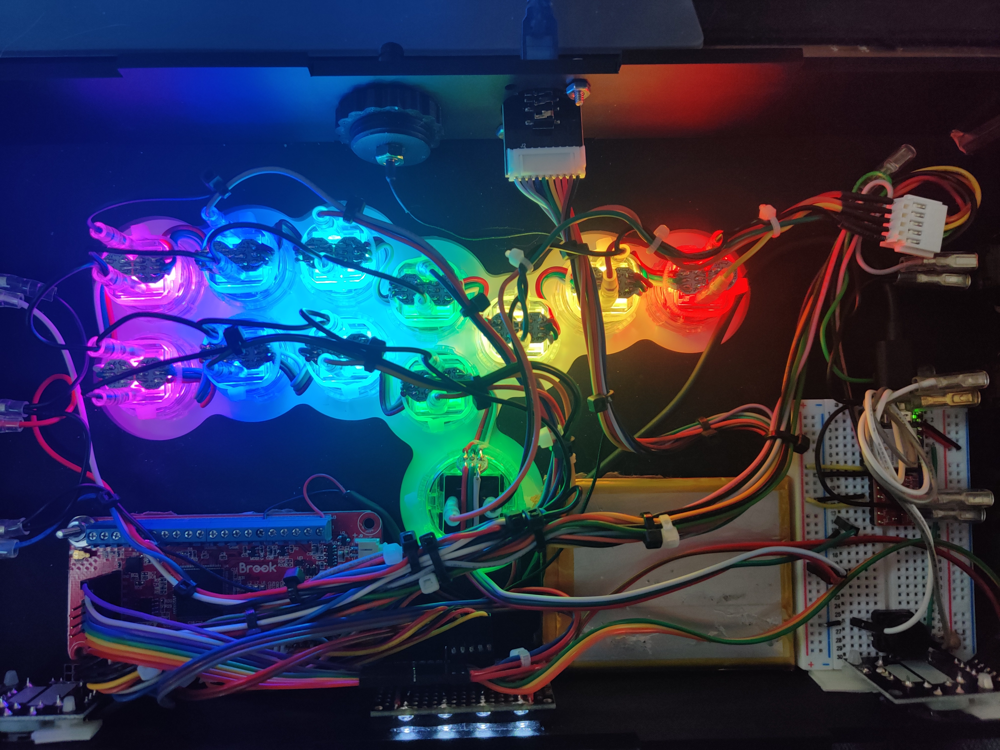

# HitBox LED Controller

Arduino RGB LED controller for HitBox style controllers.



## Effects

The list of effects are:

* Static Rainbow - From Left/Red to Right/Purple
* Rainbow Chase - Smooth rainbow effect that follows a line from Left button across the Punch buttons, wrapping right to left across Kick buttons, then down to the Up button - kind of like a question mark shape across the HitBox layout
* Rainbow Chase Columns - Moving rainbow across columns of buttons, this is probably the moving rainbow effect you're looking for
* Static Color - Select from: White, Red, Orange, Yellow, Green, Aqua, Blue, Purple
* Moving Dot - Moves a white dot around to a random button.
* Twinkle Random - Randomly colors a random number of dots with a random color.
* Theater Chase - Emulates the classic chase pattern from '50s era theater marquees. White and single color change available.
* Wipe - Colors buttons in a single line, then turns them off. White and static rainbow available.
* Running Lights - Similar to Theater Chase, but with longer on/off transition times. White and static rainbow a available.

## Details

### Hardware



The hardware I used in my controller is:

* Seeeduino XIAO Cortex M0+ @48MHz (black board)
* 24x 5v WS2812 RGB LEDs (2 LEDs per button)
* Logic level converter (red board)
* DC-DC step-up converter (blue board, only used when running from battery)
* Breadboard or protoboard
* 1x Tact Switch (for testing effect switching)
* A bunch of wire, solder, some connectors and zip ties
* A sacrificial USB-C cable

The parts here cost me about $25 from Amazon, though actual total spent is more because I had to get the LEDs in a 100-pack, and I got a 3-pack of the XIAO boards to make them a bit cheaper across several projects. I'm sure some things could be had cheaper elsewhere, but price-to-convenience ratio for the Amazon stuff is off the chart.

### Wiring



Here's a wonderful text visualization of my LED chain. This is the rear view of the HitBox layout, with `Up` being LED index 0:

```text
┌-P4--P3--P2--P1---┐
|                  └-R--D--L
└-K4--K3--K2--K1-┐
                 |
                 U--<-- From Arduino
```

This sketch was written for the Seeeduino XIAO and Adafruit Feather M0 boards, but should be usable on just about any Arduino compatible board with the right pin configuration. The effect change button requires a pin that supports interrupts.

These boards both run 3.3v logic, so I've used a logic level converter to boost the data line from the XIAO to 5v for the WS2812 LEDs. There are other methods to boost the data line, but I already had some converters available.

I haven't included a schematic, but wiring is straightforward:

1. Connect a button/switch to the `BUTTON_PIN` and ground for effect switching.
1. Connect `DATA_PIN`:
    * If using a 5v Arduino board:
        * Connect `DATA_PIN` to the first data pin on your LED chain.
    * If using a 3.3v Arduino board, do the following with the logic level converter:
        * Connect `DATA_PIN` to one of/the low side input.
        * Connect LED data pin/pad to the high side output.
        * Connect 3.3v supply from XIAO to 3.3v reference on low side.
        * Connect 5v supply to 5v reference on the high side.
        * Connect ground to both sides.
1. Connect LED chain 5v to your 5v supply (can pull from XIAO 5v if running via USB).
1. Connect LED chain ground to your supply ground.
1. [Optional] Add a capacitor (Adafruit recommended 1000µF, I'm using much lower) to the 5v and ground connected to your LEDs chain.
1. Power the XIAO from USB-C port, or directly via the 3.3v or 5v pins.

The USB-C cable was cut about a foot from the USB-C connector, and is directly wired to the USB power on the controller's encoder board (Brook Wireless Fighting Board) and plugged into the XIAO. When powering with LEDs on, make sure you either keep the LED current draw under 500mA (around 50% brightness with this setup) or the USB port supports delivering the required current.
